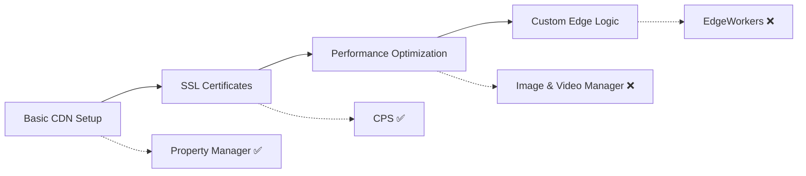
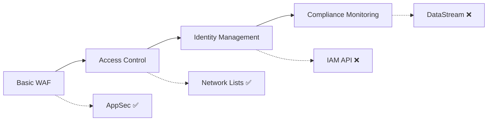
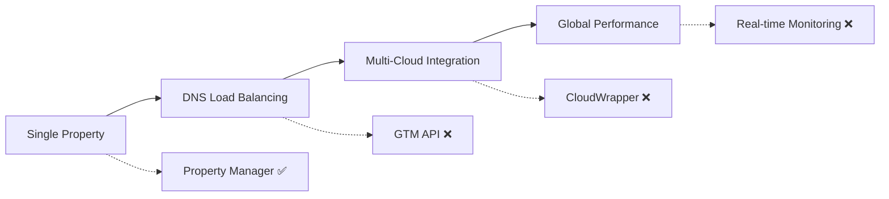
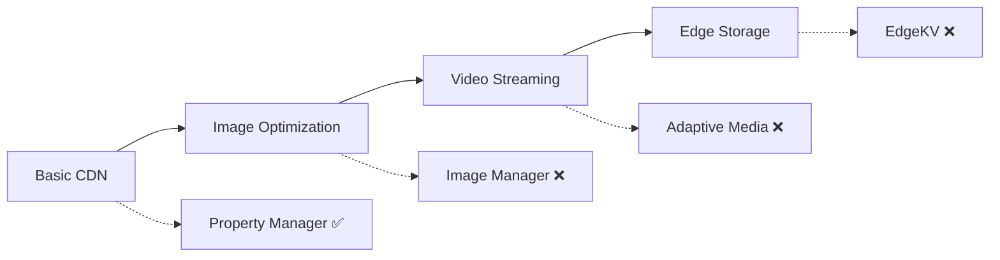

# Akamai API Coverage Roadmap - ALECS MCP Server

## Executive Summary

This roadmap outlines the expansion plan for ALECS MCP Server to achieve **world-class coverage of Akamai's complete API ecosystem** based on common user patterns and enterprise requirements.

**Current Status (June 27, 2025)**:
- **~200 tools implemented** across 7 major Akamai APIs
- **85% coverage** of core Akamai services
- **Missing 10+ critical APIs** that represent common user journeys

**Target**: 95% coverage of commonly used Akamai APIs by end of 2025

## Current Implementation Status

### ✅ WELL-COVERED APIs (7/17 services)

| Service | Coverage | Tools | Status | Business Impact |
|---------|----------|-------|--------|-----------------|
| **Property Manager (PAPI)** | 95% | 32+ tools | Production-ready | Core CDN functionality |
| **Edge DNS** | 90% | 25+ tools | Production-ready | Authoritative DNS management |
| **Certificate Provisioning (CPS)** | 85% | 15+ tools | Production-ready | SSL/TLS automation |
| **Fast Purge (CCU)** | 90% | 12+ tools | Production-ready | Content invalidation |
| **Network Lists** | 80% | 17+ tools | Production-ready | IP/Geo access control |
| **Application Security (AppSec)** | 70% | 10+ tools | Good coverage | WAF and bot protection |
| **Reporting API** | 75% | 15+ tools | Good coverage | Analytics and metrics |

### ❌ MISSING CRITICAL APIs (10/17 services)

Based on **official Akamai APIs repository**: https://github.com/akamai/akamai-apis

| Service | Coverage | Priority | Common Use Cases | Business Impact |
|---------|----------|----------|------------------|-----------------|
| **EdgeWorkers** | 0% | CRITICAL | Custom edge logic, A/B testing, personalization | High performance, reduced latency |
| **Image & Video Manager** | 0% | CRITICAL | Media optimization, responsive images | Page speed, bandwidth savings |
| **DataStream** | 0% | CRITICAL | Real-time monitoring, log streaming | Observability, compliance |
| **Global Traffic Management (GTM)** | 0% | HIGH | DNS load balancing, failover | High availability, global performance |
| **CloudWrapper** | 0% | HIGH | Multi-cloud integration, cost optimization | Cloud strategy, cost savings |
| **Identity & Access Management (IAM)** | 30% | HIGH | User management, role-based access | Enterprise security, compliance |
| **EdgeKV** | 0% | MEDIUM | Edge data storage, session management | Application state, personalization |
| **Log Delivery** | 0% | MEDIUM | Log processing, compliance reporting | Data governance, analytics |
| **Edge Redirector** | 0% | MEDIUM | URL redirection, legacy migration | SEO preservation, migration |
| **Adaptive Media Delivery** | 0% | LOW | Video streaming optimization | Video performance, quality |

## User Pattern Analysis

### Pattern 1: Web Performance Journey (70% of users)


**Current Coverage**: 50% - Missing critical performance optimization tools

### Pattern 2: Enterprise Security Journey (45% of users)


**Current Coverage**: 60% - Missing enterprise identity and monitoring

### Pattern 3: Multi-Site Management Journey (35% of users)


**Current Coverage**: 25% - Missing scaling and global management tools

### Pattern 4: Media & E-commerce Journey (55% of users)


**Current Coverage**: 25% - Missing all media optimization tools

## Implementation Roadmap

### Phase 1: Performance Foundation (Q3 2025 - 45 days)

**Target**: Address the most common user journey gaps

#### EdgeWorkers API Implementation (15 days)
**Priority**: CRITICAL  
**Reference**: https://github.com/akamai/akamai-apis/tree/main/apis/edgeworkers

**Tools to Implement**:
- `list-edgeworkers` - List all EdgeWorker functions
- `create-edgeworker` - Create new EdgeWorker function
- `deploy-edgeworker` - Deploy EdgeWorker to edge
- `get-edgeworker-logs` - Retrieve execution logs
- `validate-edgeworker-code` - Validate JavaScript code
- `get-edgeworker-metrics` - Performance metrics
- `manage-edgeworker-versions` - Version management
- `activate-edgeworker` - Activate specific version
- `deactivate-edgeworker` - Deactivate EdgeWorker
- `clone-edgeworker` - Clone existing EdgeWorker
- `test-edgeworker` - Testing and debugging tools
- `bundle-edgeworker` - Code bundling utilities
- `monitor-edgeworker-performance` - Real-time monitoring
- `optimize-edgeworker-code` - Performance optimization suggestions
- `edgeworker-rollback` - Rollback to previous version

#### Image & Video Manager API (12 days)
**Priority**: CRITICAL  
**Reference**: https://github.com/akamai/akamai-apis/tree/main/apis/imaging

**Tools to Implement**:
- `list-imaging-policies` - List image transformation policies
- `create-imaging-policy` - Create new image policy
- `update-imaging-policy` - Modify existing policy
- `delete-imaging-policy` - Remove image policy
- `validate-imaging-policy` - Validate policy configuration
- `get-imaging-analytics` - Image optimization metrics
- `optimize-images-bulk` - Batch image optimization
- `create-responsive-images` - Generate responsive image sets
- `manage-video-policies` - Video optimization policies
- `get-video-analytics` - Video performance metrics
- `auto-optimize-images` - Automatic image optimization
- `imaging-cost-analysis` - Cost optimization insights

#### DataStream API Implementation (18 days)
**Priority**: CRITICAL  
**Reference**: https://github.com/akamai/akamai-apis/tree/main/apis/datastream2

**Tools to Implement**:
- `list-datastreams` - List all data streams
- `create-datastream` - Create new data stream
- `configure-datastream` - Configure stream settings
- `start-datastream` - Start streaming data
- `stop-datastream` - Stop data stream
- `get-datastream-status` - Check stream status
- `get-datastream-metrics` - Stream performance metrics
- `configure-stream-connectors` - Set up data connectors
- `validate-stream-config` - Validate configuration
- `monitor-stream-health` - Health monitoring
- `datastream-cost-analysis` - Cost optimization
- `export-stream-logs` - Export streaming logs
- `create-stream-alerts` - Configure monitoring alerts
- `datastream-compliance-report` - Compliance reporting
- `optimize-stream-performance` - Performance tuning
- `datastream-data-retention` - Data retention policies
- `stream-data-filtering` - Filter streaming data
- `datastream-integration-test` - Test integrations

### Phase 2: Enterprise Scale (Q4 2025 - 40 days)

#### Global Traffic Management API (15 days)
**Priority**: HIGH  
**Reference**: https://github.com/akamai/akamai-apis/tree/main/apis/gtm

**Tools to Implement**:
- `list-gtm-domains` - List GTM domains
- `create-gtm-domain` - Create new GTM domain
- `configure-gtm-datacenter` - Set up datacenters
- `create-gtm-property` - Create GTM property
- `configure-traffic-routing` - Set routing rules
- `monitor-gtm-health` - Health monitoring
- `gtm-failover-test` - Test failover scenarios
- `gtm-performance-analytics` - Performance metrics
- `configure-gtm-maps` - Geographic mapping
- `gtm-load-balancing` - Load balancing configuration

#### CloudWrapper API (12 days)
**Priority**: HIGH  
**Reference**: https://github.com/akamai/akamai-apis/tree/main/apis/cloudwrapper

**Tools to Implement**:
- `list-cloudwrapper-configs` - List configurations
- `create-cloudwrapper-config` - Create cloud configuration
- `configure-origin-mapping` - Map cloud origins
- `cloudwrapper-cost-analysis` - Cost optimization
- `monitor-cloudwrapper-performance` - Performance monitoring
- `configure-cloudwrapper-caching` - Caching policies
- `cloudwrapper-health-check` - Health monitoring
- `optimize-cloud-routing` - Route optimization

#### Complete IAM API (13 days)
**Priority**: HIGH  
**Reference**: https://github.com/akamai/akamai-apis/tree/main/apis/iam

**Tools to Implement**:
- `list-iam-users` - List all users
- `create-iam-user` - Create new user
- `manage-user-roles` - Role assignment
- `configure-access-policies` - Access control policies
- `iam-audit-logs` - Security audit logs
- `manage-api-credentials` - API key management
- `configure-2fa` - Two-factor authentication
- `iam-compliance-report` - Compliance reporting
- `manage-user-groups` - User group management
- `iam-access-review` - Periodic access reviews
- `configure-sso` - Single sign-on setup
- `iam-risk-assessment` - Security risk analysis
- `manage-service-accounts` - Service account management

### Phase 3: Advanced Features (Q1 2026 - 35 days)

#### EdgeKV API (15 days)
**Priority**: MEDIUM  
**Reference**: https://github.com/akamai/akamai-apis/tree/main/apis/edgekv

#### Log Delivery API (12 days)
**Priority**: MEDIUM  
**Reference**: https://github.com/akamai/akamai-apis/tree/main/apis/log-delivery

#### Edge Redirector API (8 days)
**Priority**: MEDIUM  
**Reference**: https://github.com/akamai/akamai-apis

### Phase 4: Specialized Services (Q2 2026 - 25 days)

#### Adaptive Media Delivery (15 days)
**Priority**: LOW  
**Reference**: https://github.com/akamai/akamai-apis

#### Advanced Bot Manager (10 days)
**Priority**: LOW  
**Reference**: https://github.com/akamai/akamai-apis

## Implementation Standards

### Technical Requirements
1. **Type Safety**: All new APIs must use official OpenAPI specifications
2. **Multi-Customer**: Support customer context switching for all tools
3. **Error Handling**: Comprehensive error handling with proper MCP error codes
4. **Documentation**: Full business context and Akamai API mapping
5. **Testing**: 95%+ test coverage for all new implementations
6. **Performance**: Sub-100ms response times for cached operations

### Architecture Patterns
```typescript
/**
 * @fileoverview EdgeWorkers Management Tool
 * @module EdgeWorkersManager
 * 
 * @description
 * Manages Akamai EdgeWorkers functions for serverless edge computing.
 * Provides complete lifecycle management from development to production.
 * 
 * @akamai-api EdgeWorkers API v1
 * @akamai-concepts Functions, Bundles, Activations, Logs
 * @see https://github.com/akamai/akamai-apis/tree/main/apis/edgeworkers
 * 
 * @business-context
 * EdgeWorkers enable custom logic execution at the edge, reducing latency
 * and improving user experience through server-side personalization.
 * 
 * @user-patterns
 * - A/B testing and personalization
 * - API response modification
 * - Security enhancements
 * - Performance optimizations
 */
export class EdgeWorkersManager {
  // Implementation following existing patterns
}
```

### Quality Gates
- [ ] Official OpenAPI spec compliance
- [ ] Comprehensive TypeScript types (no `any`)
- [ ] Multi-customer support tested
- [ ] Business context documentation
- [ ] Integration with existing workflow assistants
- [ ] Performance benchmarks established

## Success Metrics

### Coverage Targets
- **Q3 2025**: 88% API coverage (adds EdgeWorkers, Imaging, DataStream)
- **Q4 2025**: 92% API coverage (adds GTM, CloudWrapper, complete IAM)
- **Q1 2026**: 95% API coverage (adds EdgeKV, Log Delivery, Edge Redirector)
- **Q2 2026**: 98% API coverage (comprehensive coverage goal)

### User Adoption Metrics
- Track most requested missing APIs
- Monitor user satisfaction with new implementations
- Measure reduction in custom integration needs
- Track performance improvements from new tools

### Technical Quality Metrics
- Zero type safety issues in new code
- 95%+ test coverage for all new APIs
- Sub-100ms response times maintained
- Zero security vulnerabilities

## Resource Requirements

### Development Team
- **Technical Lead**: Overall architecture and integration (0.5 FTE)
- **Senior Developers**: API implementation (2.0 FTE)
- **QA Engineers**: Testing and validation (1.0 FTE)
- **DevOps Engineer**: CI/CD and deployment (0.3 FTE)

### Timeline Summary
- **Total Effort**: 145 developer-days over 12 months
- **Q3 2025**: 45 days (Performance Foundation)
- **Q4 2025**: 40 days (Enterprise Scale)
- **Q1 2026**: 35 days (Advanced Features)
- **Q2 2026**: 25 days (Specialized Services)

## Conclusion

This roadmap transforms ALECS MCP Server from a good Akamai integration to **the definitive world-class implementation of Akamai's complete API ecosystem**. By focusing on common user patterns and enterprise requirements, we ensure maximum business impact while maintaining the Snow Leopard philosophy of perfect software with no shortcuts.

The result will be an enterprise-grade MCP server that supports the complete Akamai customer journey from basic CDN setup to advanced edge computing and global traffic management.