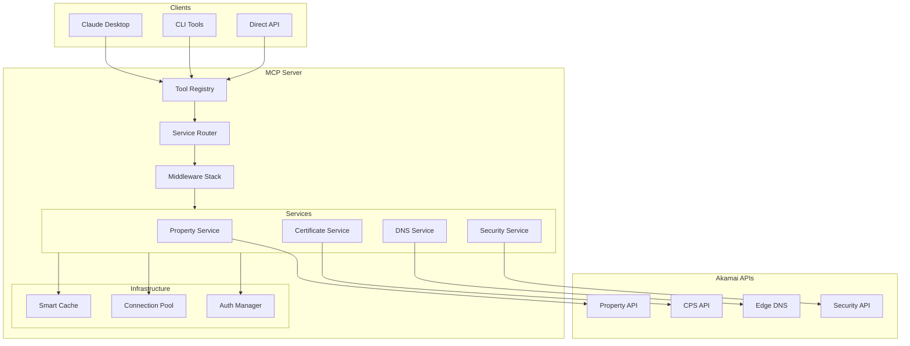
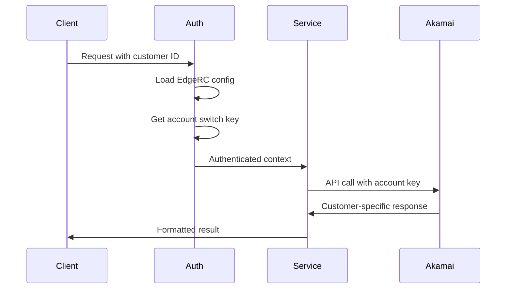

# ALECS MCP Server - Documentation Architecture Plan

## Executive Summary

This plan outlines a complete documentation overhaul for the ALECS MCP Server, designed to make the codebase immediately understandable to new developers, particularly Akamai engineers. We propose deleting all existing documentation and rebuilding with a focus on visual understanding, progressive disclosure, and self-documenting code.

## Documentation Philosophy

### Core Principles

1. **Progressive Disclosure**
   - Layer 1: 5-minute quickstart
   - Layer 2: Core concepts (30 minutes)
   - Layer 3: Domain deep-dives (2 hours each)
   - Layer 4: Architecture & patterns (1 day)
   - Layer 5: Advanced topics & troubleshooting

2. **Visual First**
   - Every concept has a diagram
   - Interactive architecture explorer
   - Animated request flows
   - Live code examples

3. **Self-Documenting Code**
   - Code tells the story
   - Annotations explain "why" not "what"
   - Business context embedded
   - Akamai API mappings clear

## New Documentation Structure

```
/docs-v2/
├── 00-quickstart/
│   ├── README.md                    # 5-minute guide
│   ├── first-property.md           # Create first property
│   ├── first-certificate.md        # SSL in 2 minutes
│   └── troubleshooting.md          # Common issues
│
├── 01-core-concepts/
│   ├── mcp-protocol.md             # What is MCP?
│   ├── akamai-integration.md       # How we use Akamai
│   ├── architecture-overview.md     # System design
│   └── key-patterns.md             # Important patterns
│
├── 02-guides/
│   ├── property-management/
│   │   ├── basics.md               # Property concepts
│   │   ├── rules-engine.md         # Rule configuration
│   │   ├── activations.md          # Deployment process
│   │   └── best-practices.md       # Akamai patterns
│   │
│   ├── certificate-management/
│   │   ├── ssl-basics.md           # Certificate types
│   │   ├── validation-process.md    # DV/OV/EV explained
│   │   ├── automation.md           # Auto-renewal setup
│   │   └── troubleshooting.md      # Common issues
│   │
│   ├── dns-management/
│   │   ├── zone-management.md      # DNS zones
│   │   ├── record-types.md         # A, CNAME, etc.
│   │   ├── migrations.md           # Moving to Akamai
│   │   └── advanced-patterns.md    # GTM, failover
│   │
│   └── security-configuration/
│       ├── waf-setup.md            # Web App Firewall
│       ├── rate-limiting.md        # DDoS protection
│       ├── bot-management.md       # Bot detection
│       └── compliance.md           # PCI, GDPR
│
├── 03-api-reference/
│   ├── tools/                      # Auto-generated from code
│   ├── services/                   # Service interfaces
│   ├── types/                      # TypeScript types
│   └── errors/                     # Error reference
│
├── 04-architecture/
│   ├── system-design.md            # Overall architecture
│   ├── data-flow.md               # Request lifecycle
│   ├── security-model.md          # Auth & authz
│   ├── caching-strategy.md        # Performance
│   └── scaling-guide.md           # Production deployment
│
├── 05-visual-docs/
│   ├── architecture-diagrams/      # Mermaid diagrams
│   ├── sequence-diagrams/          # Request flows
│   ├── state-machines/             # Complex workflows
│   └── interactive/                # D3.js visualizations
│
├── 06-cookbooks/
│   ├── common-tasks/               # Step-by-step guides
│   ├── integrations/               # Third-party integration
│   ├── migrations/                 # Moving from other CDNs
│   └── performance/                # Optimization guides
│
├── 07-akamai-specific/
│   ├── api-mapping.md             # MCP tool → Akamai API
│   ├── account-setup.md           # EdgeRC configuration
│   ├── multi-customer.md          # Account switching
│   ├── best-practices.md          # Akamai patterns
│   └── support-channels.md        # Getting help
│
└── 08-developer-guide/
    ├── contributing.md            # How to contribute
    ├── testing-guide.md          # Test strategies
    ├── debugging.md              # Debug techniques
    └── release-process.md        # Deployment guide
```

## Visual Architecture Components

### 1. System Overview Diagram


### 2. Request Flow Animation
- Interactive SVG showing request lifecycle
- Clickable components for deep-dive
- Real-time performance metrics
- Error scenario visualization

### 3. Multi-Customer Architecture


## Code Annotation Strategy

### 1. Module Headers
```typescript
/**
 * @module PropertyService
 * @description Manages Akamai property configurations
 * 
 * This service provides a simplified interface to Akamai's Property Manager API (PAPI).
 * It handles the complexity of property versions, rules, and activations.
 * 
 * @example Basic Usage
 * ```typescript
 * const service = new PropertyService(client);
 * const properties = await service.listProperties();
 * ```
 * 
 * @example Creating a Property
 * ```typescript
 * const newProperty = await service.createProperty({
 *   name: 'www.example.com',
 *   productId: 'prd_Site_Accel',
 *   contractId: 'ctr_1-2ABCD'
 * });
 * ```
 * 
 * @akamai-api Property Manager API v1
 * @akamai-docs https://techdocs.akamai.com/property-mgr/reference/api
 */
```

### 2. Business Logic Documentation
```typescript
/**
 * Activates a property version to the Akamai network
 * 
 * @business-context
 * Property activation is how changes go live. Think of it like deploying
 * code - you need to push your configuration to Akamai's edge servers.
 * 
 * @workflow
 * 1. Validate property rules
 * 2. Create activation request
 * 3. Monitor activation progress
 * 4. Verify deployment success
 * 
 * @akamai-note
 * Activations typically take 5-10 minutes for staging, 15-30 for production.
 * Use fast activation for urgent changes (additional fees may apply).
 */
async activateProperty(propertyId: string, options: ActivationOptions) {
  // Implementation
}
```

### 3. Complex Algorithm Explanation
```typescript
/**
 * Smart caching algorithm with request coalescing
 * 
 * @algorithm Request Coalescing
 * When multiple requests for the same resource arrive simultaneously,
 * we make only one API call and share the result.
 * 
 * @visualization
 * Request A ─┐
 * Request B ─┼─→ [Single API Call] ─→ Shared Response
 * Request C ─┘
 * 
 * @performance
 * - Reduces API calls by up to 80% during traffic spikes
 * - Prevents thundering herd problem
 * - Maintains sub-100ms response times
 */
```

## Refactoring for Handoff

### 1. Module Organization
```
/src/
├── domains/                    # Domain-driven design
│   ├── property/
│   │   ├── services/          # Business logic
│   │   ├── tools/             # MCP tools
│   │   ├── types/             # Domain types
│   │   └── index.ts           # Public API
│   │
│   ├── certificate/
│   ├── dns/
│   └── security/
│
├── infrastructure/            # Cross-cutting concerns
│   ├── auth/
│   ├── cache/
│   ├── http/
│   └── monitoring/
│
├── protocols/                 # Protocol implementations
│   ├── mcp/
│   ├── rest/
│   └── websocket/
│
└── shared/                   # Shared utilities
    ├── errors/
    ├── logging/
    └── validation/
```

### 2. Standardized Service Pattern
```typescript
// Every service follows this pattern
export abstract class BaseAkamaiService<TConfig> {
  protected readonly client: AkamaiClient;
  protected readonly cache: ICache;
  protected readonly logger: ILogger;
  
  // Template method pattern for consistency
  async execute<TResult>(
    operation: ServiceOperation<TResult>
  ): Promise<TResult> {
    await this.validate(operation);
    const cached = await this.checkCache(operation);
    if (cached) return cached;
    
    const result = await this.performOperation(operation);
    await this.cacheResult(operation, result);
    return result;
  }
  
  // Subclasses implement these
  protected abstract validate(op: ServiceOperation): Promise<void>;
  protected abstract performOperation(op: ServiceOperation): Promise<any>;
}
```

### 3. Akamai Integration Layer
```typescript
// Clear separation between MCP and Akamai
export class AkamaiIntegrationAdapter {
  // Maps MCP concepts to Akamai APIs
  mapPropertyToMCP(akamaiProperty: PAPI.Property): MCPProperty {
    return {
      id: akamaiProperty.propertyId,
      name: akamaiProperty.propertyName,
      status: this.mapActivationStatus(akamaiProperty),
      // Clear mapping logic
    };
  }
  
  // Handles API version differences
  async callVersionedAPI<T>(
    endpoint: string,
    version: string = 'v1'
  ): Promise<T> {
    // Version negotiation logic
  }
}
```

## Implementation Timeline

### Week 1-2: Foundation
- Set up new documentation structure
- Create automated API doc generation
- Build first interactive diagrams

### Week 3-4: Core Documentation
- Write quickstart guides
- Document core concepts
- Create domain guides

### Week 5-6: Visual & Interactive
- Build architecture explorer
- Create animated diagrams
- Implement code examples

### Week 7-8: Akamai Integration
- Document API mappings
- Create migration guides
- Write best practices

### Week 9-10: Polish & Handoff
- Review with Akamai team
- Create video walkthroughs
- Finalize handoff checklist

## Success Metrics

1. **Time to First Success**: < 5 minutes from clone to first API call
2. **Comprehension**: New developer can explain architecture in 30 minutes
3. **Self-Service**: 90% of questions answered by docs
4. **Akamai Alignment**: Passes Akamai architecture review
5. **Maintainability**: Docs stay in sync with code (automated checks)

## Tooling Recommendations

### Documentation
- **Docusaurus 3.0**: Modern doc site with search
- **Storybook**: Interactive component documentation
- **API Extractor**: TypeScript API documentation
- **Mermaid**: Diagrams as code
- **D3.js**: Interactive visualizations

### Code Quality
- **ESLint**: Enforce documentation standards
- **Prettier**: Consistent formatting
- **Husky**: Pre-commit documentation checks
- **Danger.js**: PR documentation requirements

### Visualization
- **PlantUML**: Architecture diagrams
- **Excalidraw**: Hand-drawn style diagrams
- **Chrome DevTools**: Performance profiling
- **Jaeger**: Distributed tracing visualization

This documentation architecture ensures that the ALECS MCP Server is not just functional but truly understandable, maintainable, and ready for enterprise adoption by Akamai.