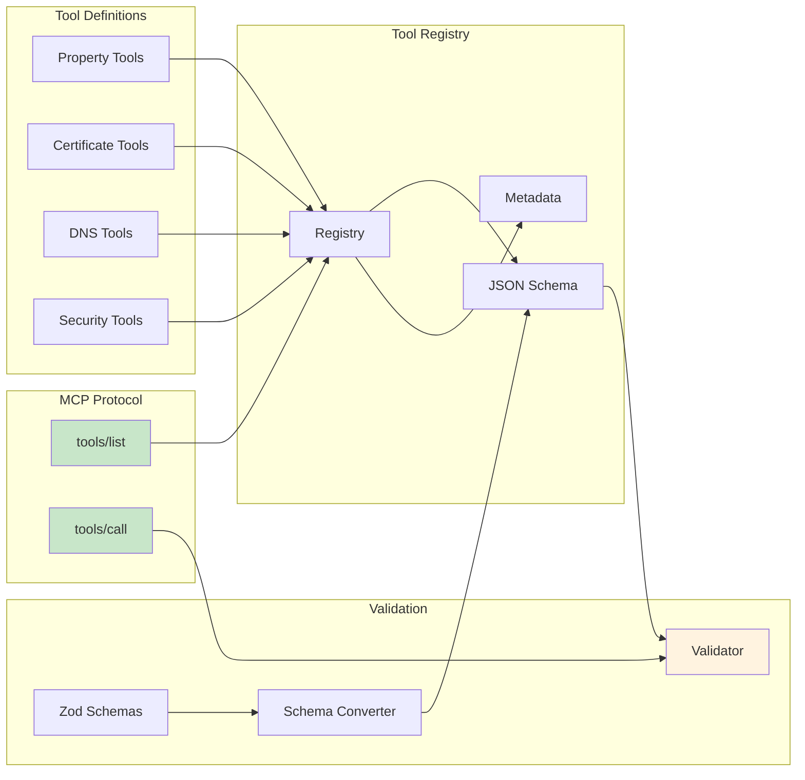

# Visual Architecture Guide - ALECS MCP Server

## Overview

This guide provides visual representations of the ALECS MCP Server architecture using Mermaid diagrams. These diagrams are designed to be rendered in documentation tools and maintained as code alongside the implementation.

## 1. System Architecture Overview


## 2. Request Flow Sequence


## 3. Multi-Customer Authentication Flow


## 4. Caching Strategy


## 5. Tool Registration and Discovery



## 6. Property Activation Workflow


## 7. Certificate Validation Process


## 8. Error Handling Flow


## 9. Service Orchestration


## 10. Production Deployment Architecture


## Implementation Notes

### Rendering These Diagrams

1. **In Markdown**: Most modern markdown renderers support Mermaid
2. **In Documentation Sites**: Docusaurus, GitBook, etc. have Mermaid plugins
3. **In GitHub**: GitHub natively renders Mermaid in markdown files
4. **In IDEs**: VS Code extensions like "Markdown Preview Mermaid Support"

### Maintaining Diagrams

1. **Version Control**: Store diagrams as code in the repository
2. **Update Process**: Update diagrams when architecture changes
3. **Review**: Include diagram updates in code reviews
4. **Testing**: Validate diagram syntax in CI/CD

### Creating New Diagrams

```bash
# Template for new architecture diagram
cat > new-diagram.md << 'EOF'

EOF
```

### Style Guide

- **Blue (#e3f2fd)**: Client/Input elements
- **Green (#c8e6c9)**: Success/Output elements
- **Orange (#fff3e0)**: Processing/Cache elements
- **Red (#ffcdd2)**: External/API elements
- **Purple (#e1bee7)**: Security/Auth elements

## Interactive Visualizations

For more complex visualizations, consider:

1. **D3.js Dashboards**: Real-time metrics and flow visualization
2. **Swagger UI**: Interactive API documentation
3. **Grafana**: Operational dashboards
4. **Draw.io**: Collaborative diagram editing
5. **PlantUML**: More detailed UML diagrams

These visual representations ensure that anyone can understand the ALECS MCP Server architecture at a glance, making onboarding faster and architectural decisions clearer.