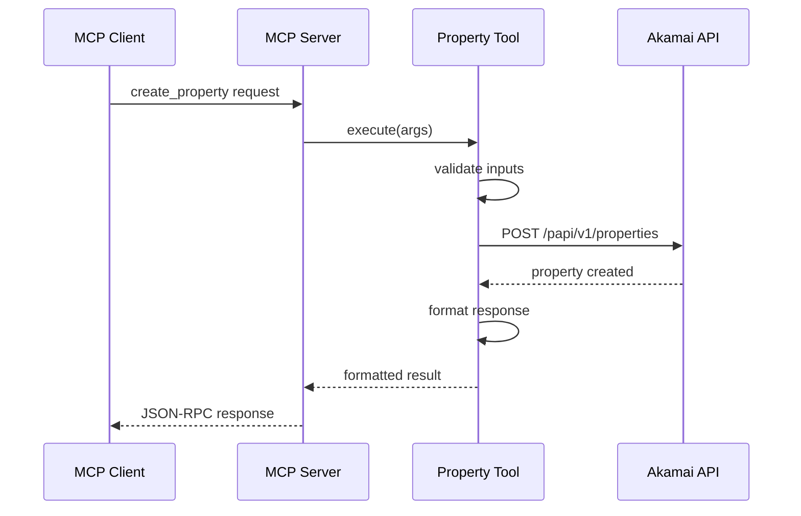

# Architecture Overview

Comprehensive technical overview of the ALECS MCP Server architecture, design patterns, and implementation details.

## Table of Contents
- [System Architecture](#system-architecture)
- [Core Components](#core-components)
- [Design Patterns](#design-patterns)
- [Data Flow](#data-flow)
- [Security Architecture](#security-architecture)
- [Scalability](#scalability)

## System Architecture

### High-Level Architecture

```
┌─────────────────┐     ┌──────────────────┐     ┌─────────────────┐
│  Claude Desktop │     │   Other MCP      │     │  CLI Clients    │
│   (Primary)     │     │   Clients        │     │                 │
└────────┬────────┘     └────────┬─────────┘     └────────┬────────┘
         │                       │                          │
         └───────────────────────┴──────────────────────────┘
                                 │
                          MCP Protocol (JSON-RPC)
                                 │
         ┌───────────────────────┴──────────────────────────┐
         │                                                   │
         │              ALECS MCP Server                     │
         │                                                   │
         │  ┌─────────────────────────────────────────────┐ │
         │  │            MCP SDK Layer                     │ │
         │  │  • Tool Registration                         │ │
         │  │  • Request/Response Handling                 │ │
         │  │  • Protocol Compliance                       │ │
         │  └─────────────────┬───────────────────────────┘ │
         │                    │                              │
         │  ┌─────────────────┴───────────────────────────┐ │
         │  │          Tool Implementation Layer           │ │
         │  │  ┌──────────┐ ┌──────────┐ ┌──────────┐    │ │
         │  │  │ Property │ │   DNS    │ │   CPS    │    │ │
         │  │  │ Manager  │ │  Tools   │ │  Tools   │    │ │
         │  │  └──────────┘ └──────────┘ └──────────┘    │ │
         │  └─────────────────┬───────────────────────────┘ │
         │                    │                              │
         │  ┌─────────────────┴───────────────────────────┐ │
         │  │           Service Layer                      │ │
         │  │  • API Clients                               │ │
         │  │  • Authentication                            │ │
         │  │  • Rate Limiting                             │ │
         │  └─────────────────┬───────────────────────────┘ │
         │                    │                              │
         └────────────────────┼──────────────────────────────┘
                              │
                       EdgeGrid Auth
                              │
         ┌────────────────────┴──────────────────────────────┐
         │              Akamai APIs                           │
         │  ┌──────────┐ ┌──────────┐ ┌──────────┐          │
         │  │  PAPI    │ │  DNS     │ │   CPS    │          │
         │  │  API     │ │  API     │ │   API    │          │
         │  └──────────┘ └──────────┘ └──────────┘          │
         └────────────────────────────────────────────────────┘
```

### Component Layers

1. **MCP Protocol Layer**
   - Handles JSON-RPC communication
   - Tool discovery and registration
   - Request routing and response formatting

2. **Tool Implementation Layer**
   - Individual tool handlers
   - Input validation with Zod schemas
   - Business logic implementation

3. **Service Layer**
   - Akamai API client management
   - EdgeGrid authentication
   - Common utilities and helpers

4. **External APIs**
   - Akamai Property API (PAPI)
   - Edge DNS API
   - Certificate Provisioning System (CPS)
   - Fast Purge API
   - Reporting API

## Core Components

### 1. MCP Server (index.ts)

The main entry point that:
- Initializes the MCP server
- Registers all available tools
- Handles lifecycle events
- Manages client connections

```typescript
class AkamaiMCPServer {
  private server: MCPServer;
  private clients: Map<string, AkamaiClient>;
  
  constructor() {
    this.server = new MCPServer({
      name: "alecs-akamai",
      version: "1.0.0"
    });
    this.registerTools();
  }
}
```

### 2. Tool Registry

Each tool module exports:
- Tool definitions with schemas
- Handler functions
- Type definitions

```typescript
interface ToolDefinition {
  name: string;
  description: string;
  inputSchema: z.ZodSchema;
  handler: (args: any, client: AkamaiClient) => Promise<any>;
}
```

### 3. Akamai Client (lib/akamai-client.ts)

Centralized API client that:
- Manages EdgeGrid authentication
- Handles multi-customer support
- Implements retry logic
- Provides typed API methods

```typescript
class AkamaiClient {
  private edgercPath: string;
  private section: string;
  private accountSwitchKey?: string;
  
  async request(options: RequestOptions): Promise<any> {
    // EdgeGrid signing
    // Account switching headers
    // Error handling
  }
}
```

### 4. Authentication System

EdgeGrid authentication implementation:
- Request signing
- Nonce generation
- Timestamp handling
- Account switching via headers

### 5. Tool Modules

Organized by service area:

```
src/tools/
├── property-tools.ts         # Basic property operations
├── property-manager-tools.ts # Advanced property management
├── dns-tools.ts             # DNS zone and record management
├── cps-tools.ts             # Certificate provisioning
├── dns-migration-tools.ts   # Migration utilities
└── reporting-tools.ts       # Analytics and reporting
```

## Design Patterns

### 1. Command Pattern

Each tool implements the command pattern:

```typescript
interface ToolCommand {
  execute(args: ToolArgs): Promise<ToolResult>;
  validate(args: unknown): ToolArgs;
  format(result: any): ToolResult;
}
```

### 2. Factory Pattern

Tool creation uses factories:

```typescript
class ToolFactory {
  static createTool(name: string): Tool {
    switch(name) {
      case 'property.list': return new ListPropertiessTool();
      case 'dns.zone.create': return new CreateZoneTool();
      // ...
    }
  }
}
```

### 3. Strategy Pattern

Different strategies for operations:

```typescript
interface ActivationStrategy {
  activate(property: Property, network: Network): Promise<Activation>;
}

class FastActivationStrategy implements ActivationStrategy {}
class SafeActivationStrategy implements ActivationStrategy {}
```

### 4. Observer Pattern

Event-driven updates:

```typescript
class ActivationMonitor extends EventEmitter {
  monitor(activationId: string) {
    this.emit('status', { id: activationId, status: 'IN_PROGRESS' });
    // Poll for updates
  }
}
```

### 5. Singleton Pattern

Shared resources:

```typescript
class ConfigManager {
  private static instance: ConfigManager;
  
  static getInstance(): ConfigManager {
    if (!this.instance) {
      this.instance = new ConfigManager();
    }
    return this.instance;
  }
}
```

## Data Flow

### Request Flow

1. **Client Request**
   ```
   MCP Client → JSON-RPC Request → MCP Server
   ```

2. **Tool Execution**
   ```
   MCP Server → Tool Handler → Service Layer → Akamai API
   ```

3. **Response Flow**
   ```
   Akamai API → Service Layer → Tool Handler → MCP Server → MCP Client
   ```

### Example: Property Creation



### State Management

1. **Stateless Operations**: Most tools are stateless
2. **Client Caching**: API clients cached per customer
3. **Progress Tracking**: Long operations use polling
4. **Transaction Support**: Change-lists for DNS operations

## Security Architecture

### Authentication Layers

1. **MCP Level**: Client authentication (future)
2. **API Level**: EdgeGrid authentication
3. **Account Level**: Multi-tenant isolation

### Security Features

1. **Credential Management**
   - Encrypted storage in `.edgerc`
   - Never exposed in logs or responses
   - Per-customer isolation

2. **Input Validation**
   - Zod schema validation
   - SQL injection prevention
   - XSS protection in outputs

3. **Rate Limiting**
   - Per-customer limits
   - Exponential backoff
   - Circuit breaker pattern

4. **Audit Logging**
   - All operations logged
   - Customer attribution
   - Sensitive data masking

### Threat Model

1. **External Threats**
   - API credential theft
   - Man-in-the-middle attacks
   - Denial of service

2. **Internal Threats**
   - Credential leakage
   - Cross-customer access
   - Privilege escalation

3. **Mitigations**
   - TLS for all communications
   - Credential rotation
   - Least privilege principle
   - Input sanitization

## Scalability

### Horizontal Scaling

1. **Stateless Design**: Servers can be replicated
2. **Load Balancing**: Round-robin or least-connections
3. **Session Affinity**: Not required

### Vertical Scaling

1. **Resource Limits**: Configurable memory/CPU limits
2. **Connection Pooling**: Reuse HTTP connections
3. **Async Operations**: Non-blocking I/O

### Performance Optimizations

1. **Caching**
   - API response caching
   - Client instance caching
   - DNS query caching

2. **Batching**
   - Bulk DNS operations
   - Parallel API requests
   - Chunked processing

3. **Monitoring**
   - Health check endpoints
   - Metrics collection
   - Performance profiling

### Deployment Patterns

1. **Single Instance**: Development/small deployments
2. **Multi-Instance**: Load-balanced production
3. **Containerized**: Docker/Kubernetes deployment
4. **Serverless**: Lambda/Function deployment (future)

## Extension Points

### Adding New Tools

1. Create tool module in `src/tools/`
2. Define Zod schema for inputs
3. Implement handler function
4. Register in `index.ts`

### Custom Templates

1. Create template in `src/templates/`
2. Export rule configuration
3. Register in template registry

### Plugin System (Future)

```typescript
interface Plugin {
  name: string;
  version: string;
  tools: ToolDefinition[];
  initialize(): Promise<void>;
}
```

## Monitoring and Observability

### Logging

- Structured logging with levels
- Correlation IDs for request tracking
- Customer attribution
- Performance metrics

### Metrics

- Request/response times
- Error rates by tool
- API call counts
- Cache hit rates

### Health Checks

```typescript
interface HealthStatus {
  status: 'healthy' | 'degraded' | 'unhealthy';
  version: string;
  uptime: number;
  checks: {
    api: boolean;
    auth: boolean;
    cache: boolean;
  };
}
```

## Best Practices

1. **Error Handling**: Always provide actionable error messages
2. **Validation**: Validate inputs at multiple levels
3. **Documentation**: Keep inline docs updated
4. **Testing**: Maintain high test coverage
5. **Security**: Follow principle of least privilege
6. **Performance**: Profile and optimize hot paths

---

*Last Updated: January 2025*